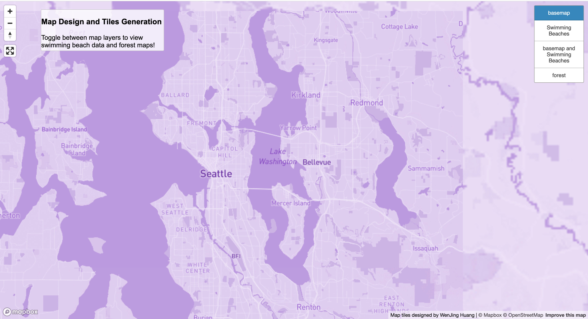
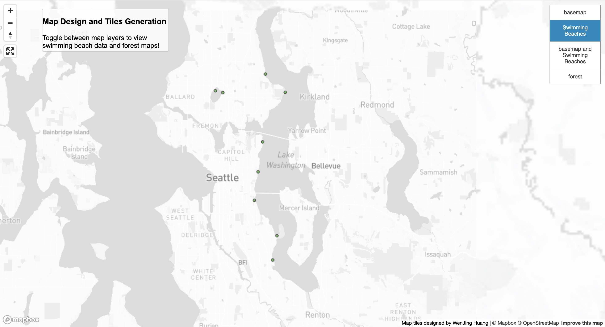
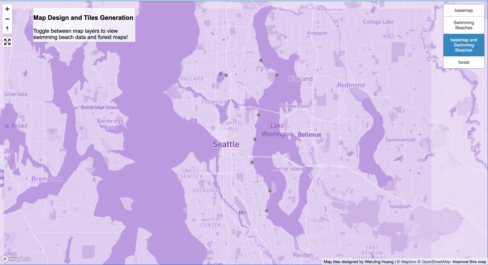
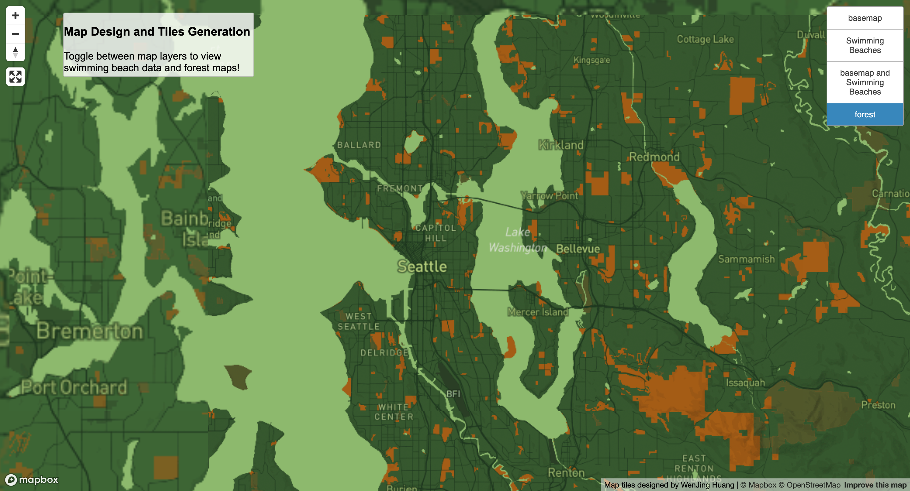

# Tiles_Generation
Wenjing Huang \
GEOG 458, Lab 4 Map Design and Tiles_ Generation

[URL to access the wen map](https://miahuang1.github.io/Map_Design_and_Tiles_Generation/)

## Tile Set Layers
### Tiles 1: Basemap

- Examined geograpghic area: Focus on Seattle Washington (-122.2559435, 47.6002614) and neighboring area
- Available zoom Layers: Max -10 and Min -7
- Decription of tile set: I customized the colors of the "Monocrome" base layer. Changes the color, size, and projection.

### Tile 2: Thematic Layer of Swimming Beaches

- Examined geograpghic area: Focus on Seattle Washington (-122.2559435, 47.6002614) and neighboring area
- Available zoom Layers: Max -10 and Min -7
- Decription of tile set: Data shows locations of life guarded swimming beaches that are managed by Seattle Parks. Does not include all beach locations within the City of Seattle. The life guards are on duty only during the summer.

### Tile 3: Basemap and Swimming Beaches

- Examined geograpghic area: Focus on Seattle Washington (-122.2559435, 47.6002614) and neighboring area
- Available zoom Layers: Max -10 and Min -7
- Decription of tile set: Put together and combine the basemap (tile 1) and  the thematic layer (Swimming beach data)from second tile.

### Tile 4: Forest (Nature) Theme

- Examined geograpghic area: Focus on Seattle Washington (-122.2559435, 47.6002614) and neighboring area
- Available zoom Layers: Max -10 and Min -7
- Decription of tile set: Map layer build from Mapbox, and using the color scheme (green) to respent the theme of forest.

## Data Source
[Swimming Beaches Data](https://data-seattlecitygis.opendata.arcgis.com/datasets/SeattleCityGIS::swimming-beaches/about) 

[Forest Theme](https://corporate.walmart.com/purpose/sustainability/planet/nature)
